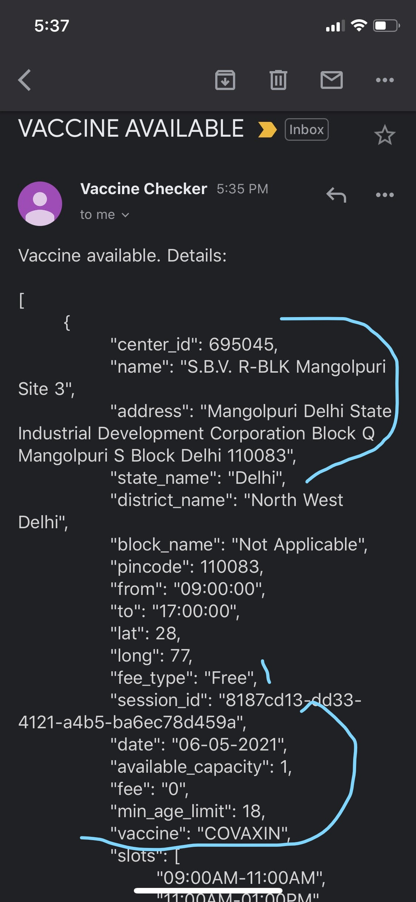

# VaccineNotifier
VaccineNotifier checks the cowin portal periodically to find vaccination slots available in your district and for your age. If found, it will send you emails every minute till the slots are available.

 Steps to run the script:  

Pre-requisite: Node js must be installed
\
link to download node js :  https://nodejs.org/en/download/
\
Command to install pm2 if it doesn't gets installed along with nodejs : $ npm install pm2 -g

Step 1) Enable application access on your gmail with steps given here:
https://support.google.com/accounts/answer/185833?p=InvalidSecondFactor&visit_id=637554658548216477-2576856839&rd=1  
\
Step 2) Enter the details in the file .env, present in the same folder
\
\
Step 3) On your terminal Go to project dir and run: 
\
  for PROD mode :   npm i && pm2 start vaccineNotifier.js
\
  for DEV mode : npm i && pm2-dev start vaccineNotifier.js
\
\
To close the app run: 
\
for PROD mode :   pm2 stop vaccineNotifier.js
\
for DEV mode : ctrl+c
\
Here's a sample of the resultant emails:

